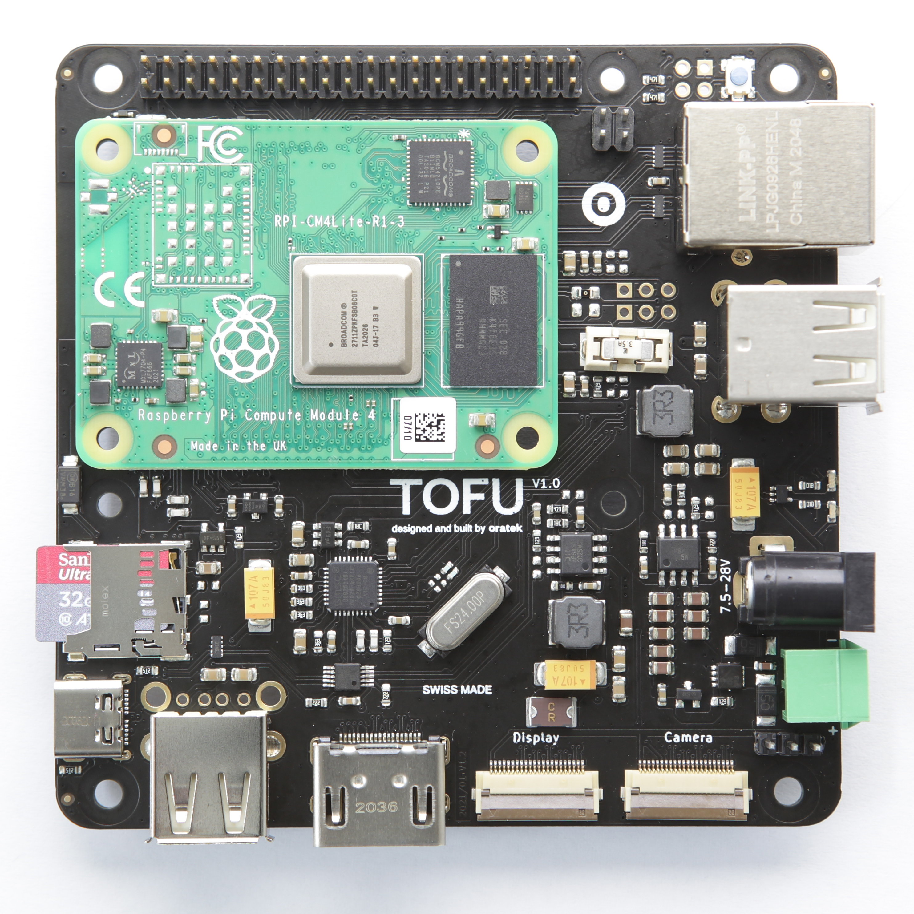
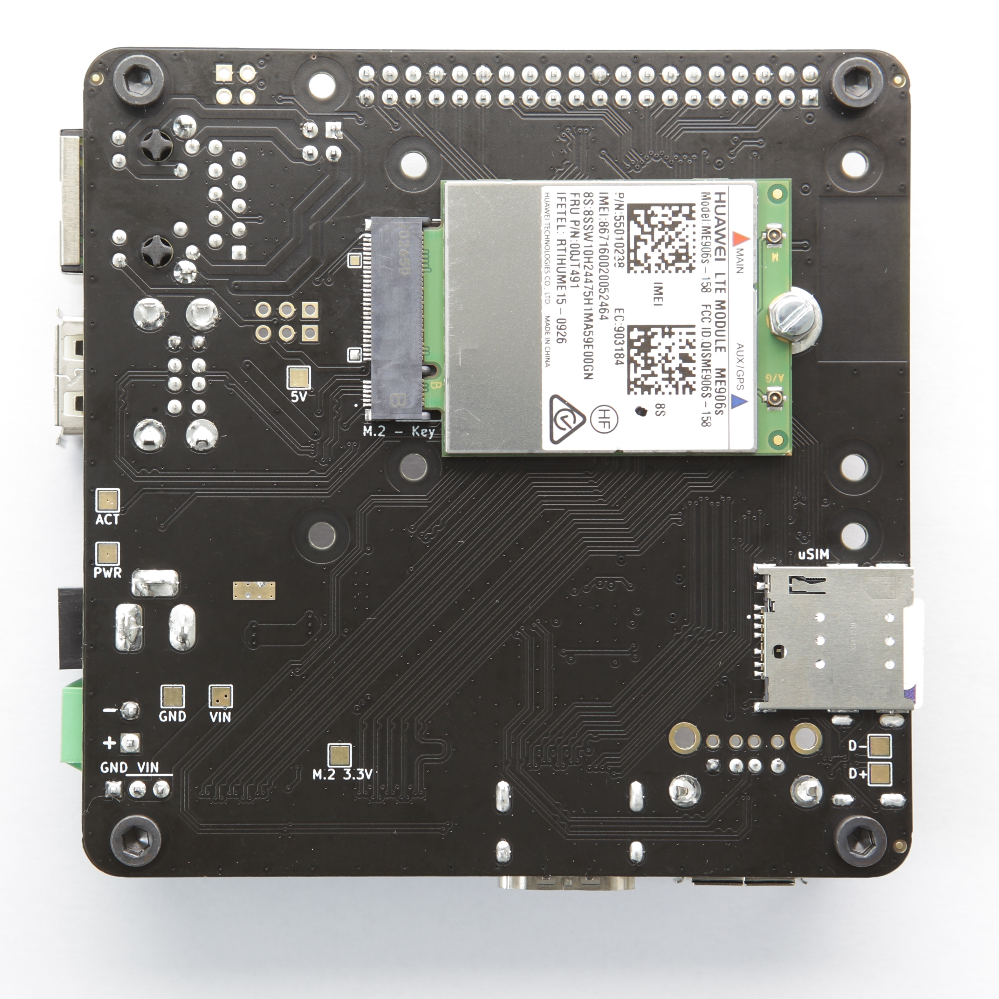
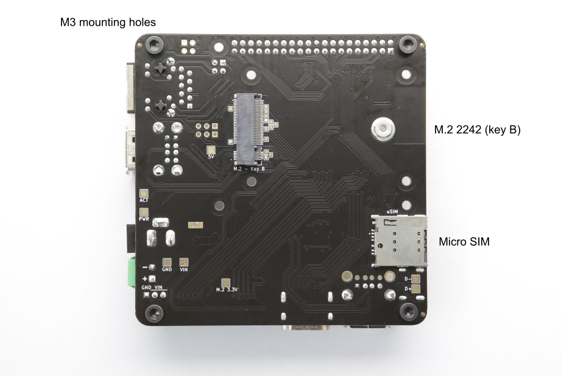
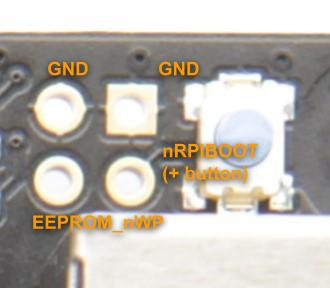

# TOFU Board
Designed by [**Oratek**](https://oratek.com) in Switzerland  
Version 1.0


## Overview
The TOFU board is a carrier board for use with Raspberry Pi Compute Module 4 (CM4).
Inspired by the official CM4IO board, it is intended for industrial applications.
With user friendly additions, it may also be used by enthusiasts looking for a compact yet complete solution to interface the many inputs and outputs of the single board computer.

  
TOFU board with mounted CM4

## Features
The size of the board is 9x9cm and its main features are :

- Standard Raspberry Pi 40 pin GPIO header
- Gigabit Ethernet port with PoE
- M.2 2242/3042 socket (key B) with micro SIM card holder. See [compatibility list](#tested-compatibility-list).
- 3x USB-A ports
- Full size HDMI port
- Camera and display ports (newer 22pin version, flexible adapter cables can be purchased separately [here](https://store.oratek.com/collections/tofu))
- Two power inputs for industrial connectors (2.1mm barrel and standard 3.5mm terminal block)
- Input voltage can be set between 7.5 and 28V and is also available on a 3x1 header for sharing to HATs requiring higher voltages (recommended power rating: >24W)
- Micro SD card slot
- USB-C port to use it as an OTG device and for programming purposes. May also be used to power the CM4, but no M.2 card due to power constraints.
- Circuit protections added for safety reasons (ESD, over- and reverse-current protections)
- Standard Raspberry Pi, CM4 and 4 additional M3 mounting holes for design flexibility



M.2 connectivity (key B) enables to fully take advantage of the new PCIe lane (here with a LTE/GPS module)

## Layout

  
Top layer design (also see [pin configurations](#pin-configurations))

  
Bottom layer design

### Additional information
| Feature | Description|
| ----------------------| :----------------------|
| CM4 connectors | 1.45mm height|
| Raspberry Pi header | Standard 40pin connector, refer to Raspberry Pi datasheets|
| EEPROM WP, eMMC boot | Optional jumper (2.54mm pitch, see [pin configurations](#pin-configurations))|
| Gb Ethernet | ESD protected, Power over Ethernet (PoE) capabilities through the official [Raspberry Pi PoE HAT](https://www.raspberrypi.org/products/poe-hat/). If using this HAT, we recommend using 10mm, M2.5 spacers, and covering the transformer with electrical tape for added protection. Using this HAT, the board will be compatible with 802.3af PoE networks. The CM4 will also enjoy a little breeze from the included fan. If using PoE through this HAT however, the M.2 connector will not be powered on due to power constraints. An alternative design could power the TOFU board below through our input voltage breakout. |
| Double USB A | Stacked USB 2.0 connectors, 1.5A current limit for all USB ports|
| Main power fuse | Littelfuse, 3.5A, NANO2 ([045303.5MR](https://www.mouser.ch/ProductDetail/Littelfuse/0453035MR/?qs=qI%252BDxnNls1%2FE840Q9SUK5A%3D%3D), or similar) |
| PWR/ACT LEDs | Red power LED, green flashing activity LED |
| Power jack | 2.1mm inside, 5.5mm outside diameter |
| Terminal block | Standard 2 positions, 3.5mm pitch |
| AC/DC power supply | No external AC/DC power supply provided. 24W is the minimum recommended power. An example could be [ACM24US12](https://www.xppower.com/product/ACM24-Series?m=ACM24US12) from XP Power.|
| Input voltage breakout | Intended as power *output* (supply for connected HATs). Can be used as input but caution is advised as it is located after the reverse polarity protection. |
| Display, camera outputs | Standard Raspberry Pi connections, 22pin, 0.5mm pitch |
| HDMI port | ESD protected, current limit protection |
| Single/double USB A | Depending on whether a USB line is needed for the M.2 port, a single or double (stacked) connector can be mounted. The USB line can be deviated through two 0402 jumpers. |
| USB C port | ESD protected. When plugged, the board will switch to USB slave (connected USB devices will stop functioning). The USB C can power the Raspberry Pi for programming purposes. However optional M.2 modules will not be powered on, similarly to PoE functionnality.  |
| Micro SD | Card slot for CM4 modules without eMMC. Push-push type connector. |
| Micro SIM | For use with compatible M.2 modules. Push-push type connector. |
| M.2 connector | The 2242 B key slot enables the use of SSDs, often with B+M key configuration, as well as network modules, which can then use the onboard micro SIM card. 1.5mm base height for the connected module. Network cards are more often available as 3042 format, which is also compatible.|

Note: When powering the device through PoE (5V line of RPi header as power input), or through USB C, a hissing noise may appear from the unused power supply. The fuse may be removed for silent operation in these cases.

## Tested compatibility list
### NVMe SSDs (M.2 2242)
- KingSpec NE 2242, 128GB
- Western Digital PC SN520, 128GB

### Wireless/LTE/GPS modules (M.2 3042)
- Huawei ME906s-158
- Huawei ME936
- Sierra Wireless AirPrime EM7345

## Technical files
### Mechanical
- [STEP file](./_assets//TOFU.zip ':ignore :target=_blank')
- [Mechanical drawings](./_assets//TOFU-drawing.pdf ':ignore :target=_blank')  

### Electical
- [Schematics](./_assets//TOFU-schematics.pdf ':ignore :target=_blank')  
- [Components reference](./_assets//TOFU-references.pdf ':ignore :target=_blank')  

## Setup

### Board features

To fully utilize the board possibilities, both USB ports and NVMe interfaces have to be enabled.

As indicated on the CM4IO board datasheet:  
"The USB interface is disabled to save power by default on the CM4. To enable it you need to add the following to the config.txt file :"
```
dtoverlay=dwc2,dr_mode=host
```

NVMe support is also  not enabled by default on Raspberry Pi OS. The command
```
sudo modprobe nvme-core
```
is needed, followed by a reboot to enable the NVMe kernel module.
More information on NVMe can be found on Jeff Geerling's CM4 [review](https://www.jeffgeerling.com/blog/2020/raspberry-pi-compute-module-4-review).

### eMMC boot
To boot on eMMC, hold down the nRPIBOOT button while plugging the USB-C cable for flashing (no other power input). The USB cable will power the CM4 while it boots. You may release the button after having plugged the cable.
More information for flashing the eMMC can be found [here](https://www.raspberrypi.org/documentation/hardware/computemodule/cm-emmc-flashing.md).

### Pin configurations
  
Boot and EEPROM options

  
Output voltage selection, Raspberry Pi 'Enable' and 'Run' pins, and wireless options

### Resources

- [Raspberry Pi Compute Module 4 datasheet](https://datasheets.raspberrypi.org/cm4/cm4-datasheet.pdf)
- [Raspberry Pi Compute Module 4 IO Board datasheet](https://datasheets.raspberrypi.org/cm4io/cm4io-datasheet.pdf)

<!--  
USB routing options -->

## Ordering options

- Complete (all connectors, 3x USB A, one USB line in M.2)
<!-- - Lite (no M.2 power supply, no M.2 connector, no SIM card holder, 4x USB A)-->

Other components may be removed (for example no M.2, 4x USB A) upon request for large quantities (>200 pieces)

For any enquiry, please contact us at hello@oratek.com

## Declarations of Conformity

- [RoHS Declaration of Conformity](./_assets/conformity//Oratek-RoHS.pdf ':ignore :target=_blank')  
- [CE Declaration of Conformity](./_assets/conformity//Oratek-TOFU-CE-Declaration_of_Conformity_\(DoC\).pdf ':ignore :target=_blank')  
- [FCC Declaration of Conformity](./_assets/conformity//Oratek-TOFU-FCC-Declaration_of_Conformity_\(DoC\).pdf ':ignore :target=_blank')  

*Raspberry Pi is a trademark of the Raspberry Pi Foundation*
